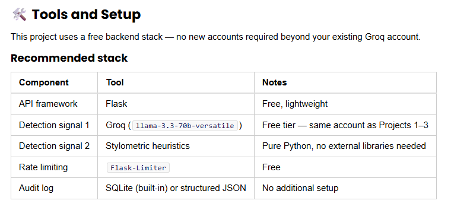

Platforms where people share original creative work — writing, music, art — are facing a new challenge: how do you know whether what someone posted was made by them, or generated by AI and passed off as human? Not to police creativity, but to protect attribution, build trust, and give audiences the context they actually need.

In this project, Provenance Guard will be built: a backend system that any creative sharing platform could plug into to classify submitted content, score confidence in that classification, surface a transparency label to users, and handle appeals from creators who believe they've been misclassified.

system architecture will be  designed from scratch before writing a single line of implementation code.

A few format requirements that are easy to miss — read these before you build:

Transparency label → write it as text in your README. Your README must include the verbatim text of all three label variants (high-confidence AI, high-confidence human, uncertain) as a quoted string or a markdown table. A screenshot or mockup is welcome as an extra, but the written text is what's required — a screenshot alone is not enough.

Architecture diagram → put it in planning.md. Include it under an ## Architecture section. ASCII art is perfectly fine (so is a committed Mermaid block or an embedded sketch). This is guidance for where your diagram lives, not a format rule.

No starter repo, no planning template. You create your own GitHub repo and design your planning.md structure yourself. Keep all of your evidence — audit-log sample, rate-limit configuration and chosen limits, label variants, and appeal handling — in your README and committed source code, which is the canonical record graders rely on.

## Goals

By completing this project, you will be able to:

Design and implement a multi-signal AI content classification pipeline.
Build confidence scoring that communicates uncertainty rather than forcing binary outputs.
Create end-user transparency labels that surface AI verdicts clearly and fairly.
Implement an appeals workflow for contested classifications.
Add production safety infrastructure: rate limiting and structured audit logging

## Features

# Required Features

Content Submission Endpoint: Build an API endpoint that accepts a piece of text-based content (a poem, a short story excerpt, a blog post) for attribution analysis. The endpoint must return a structured response including the attribution result, confidence score, and the transparency label text that would be shown to the user.

Multi-Signal Detection Pipeline: Your detection pipeline must use at least 2 distinct signals to classify content. Single-signal detection is not acceptable. Your planning.md and README must explain what each signal captures and why you chose them.

Confidence Scoring with Uncertainty: Your system must return a confidence score, not just a binary label. The score should reflect genuine uncertainty — a 0.51 confidence should produce a meaningfully different transparency label than a 0.95. Your README must explain how you approached this and how you tested whether your scores are meaningful.

Transparency Label: Design and implement the label that would be displayed to a reader on the platform. It must communicate the attribution result in plain language and make the confidence level meaningful to a non-technical reader. Include a typed description of all three label variants (high-confidence AI, high-confidence human, uncertain) in your README — write out the exact text each one displays. You're welcome to include a screenshot or mockup as well, but the written description is what's required.

Appeals Workflow: Implement a mechanism for creators to contest a classification. At minimum, an appeal must: capture the creator's reasoning, log the appeal alongside the original decision, and update the content's status to "under review." Automated re-classification is not required.

Rate Limiting: Implement rate limiting on your submission endpoint. Your README must document the limits you chose and your reasoning for those specific values.

Audit Log: Every attribution decision — including confidence score, signals used, and any appeals — must be captured in a structured audit log. Document the log in your README (or via the GET /log output) with at least 3 entries visible.

## Stretch Features

Complete any of these for extra credit. Update your planning.md before starting each one, and document any feature you complete in your README (what you built and how it works), not just planning.md.

Ensemble detection: Incorporate 3 or more detection signals with a documented weighting or voting approach.

Provenance certificate: Design and implement a "verified human" credential that a creator can earn through an additional verification step, including how it's displayed on their content.

Analytics dashboard: Build a simple view showing detection patterns, appeal rates, and one additional metric of your choosing.

Multi-modal support: Extend the pipeline to handle a second content type (e.g., image descriptions or structured metadata) in addition to text.

## Hints

A false positive (labeling a human's work as AI-generated) is worse than a false negative on a writing platform. Does your confidence scoring and label design reflect that asymmetry anywhere?

Your confidence score is a design decision before it's a technical one. Decide what you want 0.5 to mean to a user, then figure out how to achieve that — not the other way around.

The transparency label is a UX problem as much as a technical one. Show your label to someone who hasn't seen your project and ask what they understand from it before you finalize it.

Rate limiting numbers aren't arbitrary. Think about realistic usage on a writing platform: how often does a single creator submit work? How would an adversary try to flood the system? Document your reasoning.

Your detection doesn't need to be perfect — perfect AI detection is an unsolved problem. The system should acknowledge uncertainty honestly and give creators a path to appeal. That's the real engineering challenge here.

Before reaching for AI assistance, go back to your spec. If a feature is unclear, the answer is usually in a question you didn't think through during Milestone 2.

## A note on detection signals:
Your system needs at least 2 distinct signals. "Distinct" means they capture genuinely different properties of the text — not two versions of the same approach. A strong default pairing:

LLM-based classification (Groq): ask the model to assess whether text reads as human or AI-generated. Captures semantic and stylistic coherence holistically.

Stylometric heuristics: measurable statistical properties that differ between human and AI writing — sentence length variance, type-token ratio (vocabulary diversity), punctuation density, or average sentence complexity. AI text tends to be more uniform; human writing is more variable. Computable in pure Python.

These two signals are genuinely independent: one is semantic, one is structural. That makes the combination more informative than either alone.

##  Architecture Narrative Draft

In plain English write the path a single piece of text takes from submission to the label a user sees. Name every system component it touches and what each one does.

I want to use a multi-signal approach using three signals Statistical/stylometric features, sematic embeddings and a watermarking based approach that contributes to the confidence score only when it fires positively. The Statistical/stylometric features is groq that will return a structured JSON with confidence score, label, reasoning, the important relevant information needed. 

The most important stylometric features are Type-Token Ratio (TTR = unique tokens / total tokens), which measures lexical diversity, mean sentence length, and sentence-length standard deviation. Additional high-signal features include AI phrase density and punctuation entropy.

 The passive watermark detection checks for statistically unlikely concentrations of "green list" tokens using a z-score hypothesis test based on the KGW framework. A z-score above 4.0 is treated as evidence of LLM generation. This signal is additive only — a negative result does not reduce confidence, since most AI-generated content submitted to the platform will not carry an embedded watermark. It is included because some platforms (C2PA-compliant tools, Bing Image Creator, certain enterprise LLMs) are beginning to embed watermarks by default, so detecting them where present adds genuine signal at zero cost.

 Flask Limiter

 Setup is minimal. Each Limiter instance must be initialized with a key_func that returns the bucket in which each request is put into when evaluating whether it is within the rate limit or not.

 the submission endpoint calls an LLM (Groq) per request, making it expensive. Setting 10 per minute per IP protects your free-tier quota and prevents abuse. The appeals endpoint can be more generous — something like 30 per hour is reasonable since it's write-only.

 Audit Log - SQLite is the simpler path and keeps it all in one file.

Confidence Score Design - The two signals return scores independently — you need to merge them into one final confidence.  A simple weighted average should work

### my Description 

The application/service/site will send an api call to the content submission endpoint and the endpoint will accept the text based content. before analysis can be done the rate limiter will look at the request and see if the IP exceeded its limit. Then the content will go through analysis the content will run through the signals (either parallel or sequence) and each will produce there own independent score the watermarking signal being optional depending on if it finds anything positive. After that the scores will be combined into one super final confidence score.

After analysis, three things happen simultaneously:

- A structured response gets sent back to the caller with the label, confidence, and transparency label text

- The decision gets written to the audit log (this happens every time, regardless of outcome)

- The content record gets stored so it can be referenced later if an appeal comes in

Separately, the appeals endpoint is an entirely different flow that doesn't touch the detection pipeline at all — it just updates the status of an existing record in storage.

Now when it come to false positives ie. human content flagged as AI or AI flagged as human. The confidence scoring handles uncertain text by using a transparency label to protect the creator rather than imply accusation, communicating something like: "Our system could not confidently determine the origin of this content. This work has not been flagged as AI-generated." This design choice — erring toward uncertainty rather than a damaging wrong label on borderline cases — is the first line of defense against false positive harm.

The second line of defense is the appeals workflow. If a creator believes they have been misclassified, they can submit an appeal with their reasoning, which gets logged alongside the original score and the label that was shown. Together, the confidence threshold design, the uncertain label framing, and the structured audit trail make sure that a false positive is not just less likely to cause harm, but recoverable when it does occur.

flowchart TD
    A([Platform / App]) -->|POST /submit\ncontent + creator_id| B

    B{Rate limiter\nFlask-Limiter}
    B -->|limit exceeded| C([429 Too Many Requests])
    B -->|passes through| D

    D[Detection pipeline]

    D --> E[Signal 1\nGroq LLM]
    D --> F[Signal 2\nStylometric heuristics]
    D --> G[Signal 3\nWatermark z-score]

    E --> H[Score combiner\nweighted average]
    F --> H
    G --> H

    H --> I{Confidence\nthreshold}
    I -->|>= 0.85| J[Label: high-confidence AI]
    I -->|<= 0.20| K[Label: high-confidence human]
    I -->|between| L[Label: uncertain]

    J --> M[Build response\nlabel + confidence + transparency text]
    K --> M
    L --> M

    M --> N[(Audit log\nSQLite or JSONL)]
    M --> O([Structured response\nreturned to platform])

    P([Platform / App]) -->|POST /appeals/content_id\nreason| Q[Appeals handler]
    Q --> R[Look up content_id\nin storage]
    R --> S[Append appeal\nto audit log]
    S --> T[Update status\nto under_review]
    T --> U([200 Confirmed])

    V([Platform / App]) -->|GET /log| W[Read audit log]
    W --> X([Return last N entries])
